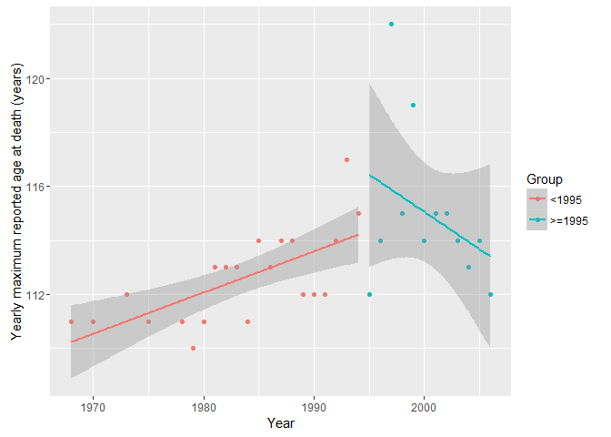

Technical comment on Evidence for a limit to human lifespan
================
Philipp Berens
October 9, 2016

Dong et al. claim to present statistical evidence in favor of an absolute limit to the human lifespan. Here I present a reanalysis of a central figure in their paper showing that in fact the data is uninformative with regards to the question whether there is a limit to human lifespan or not.

The model by the authors
------------------------

The authors graph the maximum age reported at death (MRAD) for each year between 1968 and 2006. I acquired the data using WebPlotDigitizer and rounded the numbers to full years (which is what likely was the case for the original data). Originally the data came from the [IDL Database](http://www.supercentenarians.org/).

Here is the raw data, as presented by the authors, fitting separate regression for years up to 1994 and after 1995.



The plot shows the raw data points in black and separate linear fits with 95%-CIs for years before and after 1995. It is not clear from the paper why the authors chose 1995 as a point to separate models.

We can also obtain the statistics for this model by fitting a linear model with the additional group-variable as predictor including interactions, allowing for a changes slope and offset for the data after 1995.

``` r
mdl1 <- lm(Age~Year*Group,tbl)
summary.lm(mdl1)
```

    ## 
    ## Call:
    ## lm(formula = Age ~ Year * Group, data = tbl)
    ## 
    ## Residuals:
    ##     Min      1Q  Median      3Q     Max 
    ## -4.4359 -1.0757  0.0871  0.7616  6.1166 
    ## 
    ## Coefficients:
    ##                   Estimate Std. Error t value Pr(>|t|)  
    ## (Intercept)      -191.0734   116.0246  -1.647   0.1104  
    ## Year                0.1531     0.0585   2.617   0.0139 *
    ## Group>=1995       858.5757   347.1723   2.473   0.0195 *
    ## Year:Group>=1995   -0.4293     0.1737  -2.472   0.0196 *
    ## ---
    ## Signif. codes:  0 '***' 0.001 '**' 0.01 '*' 0.05 '.' 0.1 ' ' 1
    ## 
    ## Residual standard error: 1.956 on 29 degrees of freedom
    ## Multiple R-squared:  0.4163, Adjusted R-squared:  0.3559 
    ## F-statistic: 6.893 on 3 and 29 DF,  p-value: 0.001209

Consistent with the paper, the fitted model has a slope of 0.153 years for years before 1995 and one of -0.276 for years afterwards (compare their Figure 2a).

A linear model
--------------

A simple alternative hypothesis to the claim of the authors would be that MRAD actually keeps increasing and therefore, that there is no limit to human lifespan. To model this idea, we fit a simple linear model to the data:


The plots shows the raw data points again, with a linear regression with 95% CIs fitted to all the data.

``` r
mdl2 <- lm(Age~Year,tbl)
summary.lm(mdl2)
```

    ## 
    ## Call:
    ## lm(formula = Age ~ Year, data = tbl)
    ## 
    ## Residuals:
    ##     Min      1Q  Median      3Q     Max 
    ## -3.4791 -1.3544  0.0139  0.6343  7.6428 
    ## 
    ## Coefficients:
    ##               Estimate Std. Error t value Pr(>|t|)   
    ## (Intercept) -134.56615   69.84837  -1.927  0.06325 . 
    ## Year           0.12465    0.03511   3.550  0.00125 **
    ## ---
    ## Signif. codes:  0 '***' 0.001 '**' 0.01 '*' 0.05 '.' 0.1 ' ' 1
    ## 
    ## Residual standard error: 2.088 on 31 degrees of freedom
    ## Multiple R-squared:  0.2891, Adjusted R-squared:  0.2662 
    ## F-statistic: 12.61 on 1 and 31 DF,  p-value: 0.001251

In this case, MRAD increases slightly by 0.12 years per year.

Model comparison
----------------

Which model is better? In the paper, the authors fail to provide evidence for their model, they seem to argue that the data looks like there is a saturation effect or a decline in MRAD after 1995.

One can do better and objectively compare the two fitted models. If we look at the output of the models above, the model by the authors explains a little more variance in the data than the linear model (0.42 vs. 0.29). On the other hand, the model also uses four parameters to do so, compared to only two in the linear model.

We can therefore ask if the increase in explained variance is "worth" the additional parameters, e.g. by comparing the Bayesian Information Criterion (BIC) of the two models. This is a goodness of fit measure penalized for the number of parameters.

``` r
BIC(mdl1)
```

    ## [1] 151.1461

``` r
BIC(mdl2)
```

    ## [1] 150.6574

Following Kass and Raftery (1993), a BIC difference of 0.49 is not worth mentioning, providing no evidence of one versus the other model.

Bayesian modeling
-----------------

Above, we followed a classical frequentist approach towards regression modeling. Alternatively, one can take a Baysian approach and fit the full linear model including interaction terms with a student-t prior yielding modest shrinkage of the coefficients towards zero, i.e. performing some variable selection.

We fit the models using the package `rstanarm`, which allows relatively straightforward use of Bayesian methods.

``` r
bmdl <- stan_glm(Age~Year*Group, tbl, 
                 prior = student_t(5, 0, 2.5), 
                 family = gaussian(), 
                 adapt_delta = 0.99)
```

    ## 
    ## SAMPLING FOR MODEL 'continuous' NOW (CHAIN 1).
    ## 
    ## Chain 1, Iteration:    1 / 2000 [  0%]  (Warmup)
    ## Chain 1, Iteration:  200 / 2000 [ 10%]  (Warmup)
    ## Chain 1, Iteration:  400 / 2000 [ 20%]  (Warmup)
    ## Chain 1, Iteration:  600 / 2000 [ 30%]  (Warmup)
    ## Chain 1, Iteration:  800 / 2000 [ 40%]  (Warmup)
    ## Chain 1, Iteration: 1000 / 2000 [ 50%]  (Warmup)
    ## Chain 1, Iteration: 1001 / 2000 [ 50%]  (Sampling)
    ## Chain 1, Iteration: 1200 / 2000 [ 60%]  (Sampling)
    ## Chain 1, Iteration: 1400 / 2000 [ 70%]  (Sampling)
    ## Chain 1, Iteration: 1600 / 2000 [ 80%]  (Sampling)
    ## Chain 1, Iteration: 1800 / 2000 [ 90%]  (Sampling)
    ## Chain 1, Iteration: 2000 / 2000 [100%]  (Sampling)
    ##  Elapsed Time: 0.643 seconds (Warm-up)
    ##                0.924 seconds (Sampling)
    ##                1.567 seconds (Total)
    ## 
    ## 
    ## SAMPLING FOR MODEL 'continuous' NOW (CHAIN 2).
    ## 
    ## Chain 2, Iteration:    1 / 2000 [  0%]  (Warmup)
    ## Chain 2, Iteration:  200 / 2000 [ 10%]  (Warmup)
    ## Chain 2, Iteration:  400 / 2000 [ 20%]  (Warmup)
    ## Chain 2, Iteration:  600 / 2000 [ 30%]  (Warmup)
    ## Chain 2, Iteration:  800 / 2000 [ 40%]  (Warmup)
    ## Chain 2, Iteration: 1000 / 2000 [ 50%]  (Warmup)
    ## Chain 2, Iteration: 1001 / 2000 [ 50%]  (Sampling)
    ## Chain 2, Iteration: 1200 / 2000 [ 60%]  (Sampling)
    ## Chain 2, Iteration: 1400 / 2000 [ 70%]  (Sampling)
    ## Chain 2, Iteration: 1600 / 2000 [ 80%]  (Sampling)
    ## Chain 2, Iteration: 1800 / 2000 [ 90%]  (Sampling)
    ## Chain 2, Iteration: 2000 / 2000 [100%]  (Sampling)
    ##  Elapsed Time: 0.622 seconds (Warm-up)
    ##                0.766 seconds (Sampling)
    ##                1.388 seconds (Total)
    ## 
    ## 
    ## SAMPLING FOR MODEL 'continuous' NOW (CHAIN 3).
    ## 
    ## Chain 3, Iteration:    1 / 2000 [  0%]  (Warmup)
    ## Chain 3, Iteration:  200 / 2000 [ 10%]  (Warmup)
    ## Chain 3, Iteration:  400 / 2000 [ 20%]  (Warmup)
    ## Chain 3, Iteration:  600 / 2000 [ 30%]  (Warmup)
    ## Chain 3, Iteration:  800 / 2000 [ 40%]  (Warmup)
    ## Chain 3, Iteration: 1000 / 2000 [ 50%]  (Warmup)
    ## Chain 3, Iteration: 1001 / 2000 [ 50%]  (Sampling)
    ## Chain 3, Iteration: 1200 / 2000 [ 60%]  (Sampling)
    ## Chain 3, Iteration: 1400 / 2000 [ 70%]  (Sampling)
    ## Chain 3, Iteration: 1600 / 2000 [ 80%]  (Sampling)
    ## Chain 3, Iteration: 1800 / 2000 [ 90%]  (Sampling)
    ## Chain 3, Iteration: 2000 / 2000 [100%]  (Sampling)
    ##  Elapsed Time: 0.662 seconds (Warm-up)
    ##                0.527 seconds (Sampling)
    ##                1.189 seconds (Total)
    ## 
    ## 
    ## SAMPLING FOR MODEL 'continuous' NOW (CHAIN 4).
    ## 
    ## Chain 4, Iteration:    1 / 2000 [  0%]  (Warmup)
    ## Chain 4, Iteration:  200 / 2000 [ 10%]  (Warmup)
    ## Chain 4, Iteration:  400 / 2000 [ 20%]  (Warmup)
    ## Chain 4, Iteration:  600 / 2000 [ 30%]  (Warmup)
    ## Chain 4, Iteration:  800 / 2000 [ 40%]  (Warmup)
    ## Chain 4, Iteration: 1000 / 2000 [ 50%]  (Warmup)
    ## Chain 4, Iteration: 1001 / 2000 [ 50%]  (Sampling)
    ## Chain 4, Iteration: 1200 / 2000 [ 60%]  (Sampling)
    ## Chain 4, Iteration: 1400 / 2000 [ 70%]  (Sampling)
    ## Chain 4, Iteration: 1600 / 2000 [ 80%]  (Sampling)
    ## Chain 4, Iteration: 1800 / 2000 [ 90%]  (Sampling)
    ## Chain 4, Iteration: 2000 / 2000 [100%]  (Sampling)
    ##  Elapsed Time: 0.588 seconds (Warm-up)
    ##                0.631 seconds (Sampling)
    ##                1.219 seconds (Total)

We can summarize the fitted model and plot the posterior density over the parameters:

``` r
plot(bmdl,'dens')
```


``` r
bmdl
```

    ## stan_glm(formula = Age ~ Year * Group, family = gaussian(), data = tbl, 
    ##     prior = student_t(5, 0, 2.5), adapt_delta = 0.99)
    ## 
    ## Estimates:
    ##                  Median MAD_SD
    ## (Intercept)      -87.0  119.1 
    ## Year               0.1    0.1 
    ## Group>=1995        0.9    8.7 
    ## Year:Group>=1995   0.0    0.0 
    ## sigma              2.2    0.3 
    ## 
    ## Sample avg. posterior predictive 
    ## distribution of y (X = xbar):
    ##          Median MAD_SD
    ## mean_PPD 113.4    0.5 
    ## 
    ## Observations: 33  Number of unconstrained parameters: 5

Comparing the fitted model to the frequentist models above shows that the posterior median of the linear effect of Year (0.101) is very similar to the estimated value above (0.153). The interaction term on the slope are effectively set to zero during inference, arguing that there is little evidence of a different slope after 1995. There is a small effect of the interaction term on the y-intercept, increasing the estimated y-intercept by 900. This is likely an artefact of the model parametrization.

``` r
draws <- as.data.frame(as.matrix(bmdl))
X <- draws[1:200,1:4]
foomdl <- mdl1
tbl2 <- tbl["Year"]

base <-ggplot(tbl, aes(x = Year, y = Age))
for (i in 1:200){
  foomdl$coefficients <- c(X[i,1], X[i,2], X[i,3], X[i,4]) 
  tbl2["Pred"] <- predict.lm(foomdl,tbl)
  
  base <- base + geom_line(data=tbl2,mapping = aes(x=Year, y=Pred), color="skyblue", alpha=0.5,size=1.1)
}

X = coef(bmdl)
foomdl$coefficients <- c(X[1], X[2], X[3], X[4]) 
tbl2["Pred"] <- predict.lm(foomdl,tbl)


base + 
  geom_point() + 
  geom_line(data=tbl2,mapping = aes(x=Year, y=Pred),size=1.1)
```


We check certain properties of the Bayesian fitting procedures graphically:

Conclusion
----------

TODO

References
----------

-   Kass and Raftery (1993): Bayes Factor, Journal of the American Statistical Assosciation, [link](http://www.tandfonline.com/doi/abs/10.1080/01621459.1995.10476572)

-   Vehtari, Gelman and Gabry (2016): Practical Bayesian model evaluation using leave-one-out cross-validation and WAIC, arxiv [link](https://arxiv.org/pdf/1507.04544v5.pdf)
