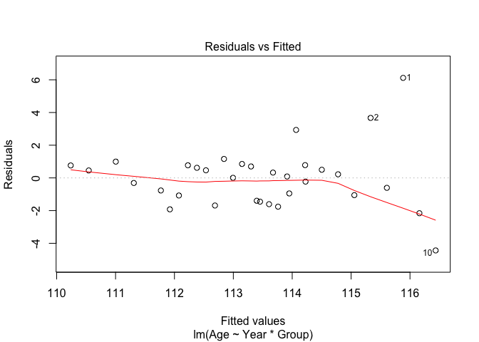
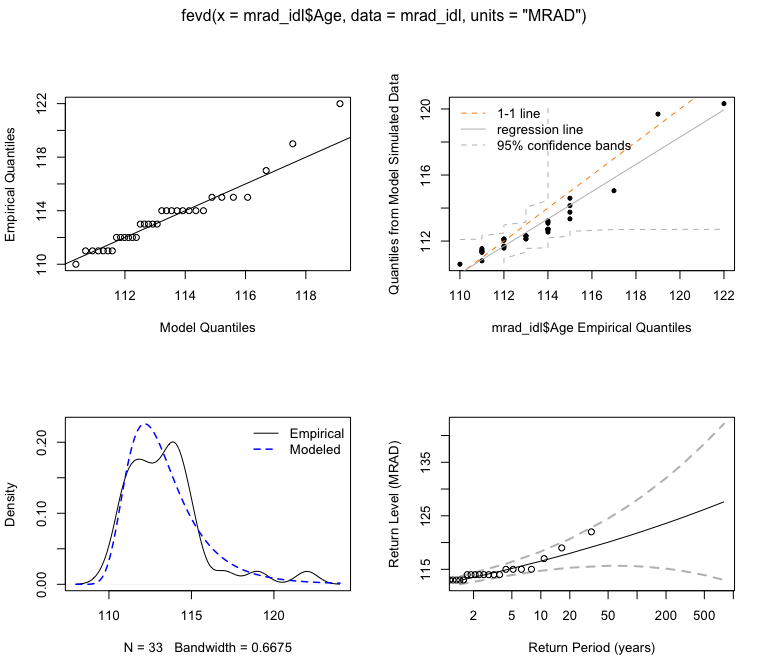
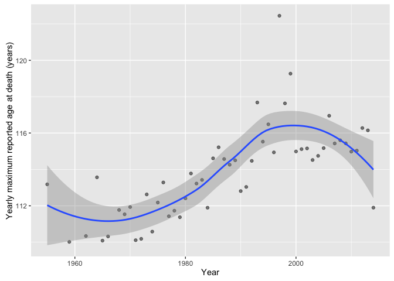
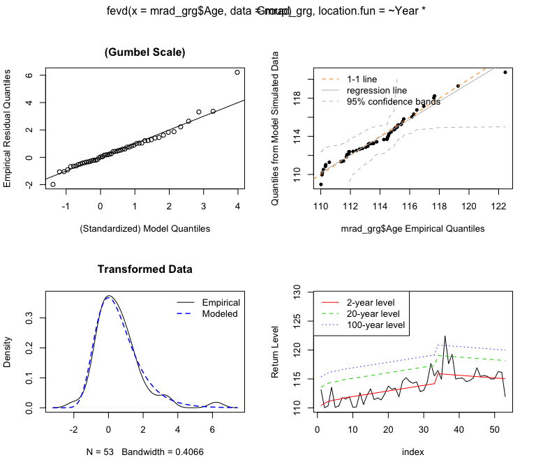

Extreme value analysis of “Evidence for a limit to Human Lifespan
================
Tom Wallis and Philipp Berens
15 October 2016

In our [earlier analysis](https://github.com/philippberens/lifespan/blob/master/analysis.md), we compared the "trend break" model of Dong et al to a simple linear model. We found that the dataset reported by the authors in their Fig 2a (from the [IDL Database](http://www.supercentenarians.org/)) offered equivocal support for their model relative to a simple linear model. However, compiling a more complete version of the age-of-death of "verified supercentenarians" (from the Gerontology Research Group [website](http://www.grg.org/Adams/A.HTM)) *did* provide support for their model relative to a simple linear one. These data, under these models, support the authors' claim that human maximum lifespan may be saturating or decreasing.

``` r
idl_linear_model <- lm(Age ~ Year, mrad_idl)
idl_author_model <- lm(Age ~ Year * Group, mrad_idl)

# prepare data:
tmp1 <- mrad_idl
tmp2 <- mrad_idl
tmp1$model <- "Trend break"
tmp1$yhat <- predict(idl_author_model)
tmp2$model <- "Linear"
tmp2$yhat <- predict(idl_linear_model)

combined_data <- rbind(tmp1, tmp2)

plt <- ggplot(combined_data, aes(x = Year, y = Age, colour = Group)) + 
  facet_grid(~ model) + 
  geom_point() +
  geom_line(aes(y = yhat))

# appearance:
plt <- plt + 
  scale_y_continuous(name = "Yearly maximum reported age at death (years)",
                     breaks = seq(110, 126, by = 2)) + 
  ylab("Yearly maximum reported age at death (years)") +
  theme_minimal(base_size = 8) + 
  theme(panel.grid.major = element_line(colour = "grey90", size = 0.5)) + 
  theme(panel.margin = unit(2, "lines")) + 
  scale_color_manual(values = c("#4A87CB", "#E76826"), name = "") + 
  theme(legend.position = "bottom")

plt
```


However, the data under consideration are the yearly *maxima* of a much larger distribution (age-at-death for the human population). The models considered above assume that the data will be subject to noise that is Gaussian distributed. A plot of the residuals of the model fit shows that this assumption isn't met: there are three datapoints that lie well outside the range expected by the error model.

``` r
plot(idl_author_model, which = 1)
```



This is very likely because of the meaning of the underlying data: they are *extreme values* drawn from a larger distribution. Thus, the models assumed above are not appropriate for modelling these data.

Extreme value analysis
======================

The appropriate approach to statistical inference based on these data is to use extreme value analysis (e.g. Coles, 2001), which seeks to model data with a low probability of occurrence (for example, a person living over the age of 110). Specifically, the data at hand are an example of *block maxima*, in which the maximum is computed for each "block" (a year in this case) of a distribution (here, the distribution of age-at-death). The distribution of block maxima are known to follow a Generalised Extreme Value (GEV) distribution as the number of blocks approaches infinity (see Coles, 2001 or Gilleland & Katz, 2016). The GEV has three parameters: a location parameter that defines the centre of the distribution, a scale that defines its spread, and a shape parameter that defines the weight of the tails. Specifically, if shape = 0, the GEV is the Gumbel distribution; if shape &gt; 0 the distribution is Frechet and has heavier tails; if shape &lt; 0 the distribution is reverse Weibull and has a bounded upper tail.

IDL dataset from Dong et al Fig 2a
==================================

Fitting a GEV model to the MRAD data from the IDL set (using the `extRemes` package in R; Gilleland & Katz (2016)) produces:

``` r
idl_fit1 <- fevd(mrad_idl$Age, mrad_idl, units = "MRAD")
summary(idl_fit1)
```

    ## 
    ## fevd(x = mrad_idl$Age, data = mrad_idl, units = "MRAD")
    ## 
    ## [1] "Estimation Method used: MLE"
    ## 
    ## 
    ##  Negative Log-Likelihood Value:  70.04727 
    ## 
    ## 
    ##  Estimated parameters:
    ##     location        scale        shape 
    ## 112.31347193   1.63390077   0.09565364 
    ## 
    ##  Standard Error Estimates:
    ##  location     scale     shape 
    ## 0.3220412 0.2424644 0.1344744 
    ## 
    ##  Estimated parameter covariance matrix.
    ##             location        scale        shape
    ## location  0.10371050  0.037574941 -0.014606188
    ## scale     0.03757494  0.058789008 -0.006214956
    ## shape    -0.01460619 -0.006214956  0.018083375
    ## 
    ##  AIC = 146.0945 
    ## 
    ##  BIC = 150.5841

We can see that the location parameter is 110, which is plausible given the range of the data. The shape parameter is 0.10 (with standard error 0.13), indicating that the distribution of values here is approximately Gumbel.

<!-- We can also see that the AIC of this model is 146 and the BIC is 150.6. -->
<!-- Compared to this, the authors' model assuming Gaussian noise is better according to AIC (140) and about the same according to BIC (150). -->
``` r
plot(idl_fit1)
```



The diagnostic plots above show that the quantiles of the model correspond reasonably to the empirical quantiles.

Linear model
------------

The model above assumes that the distribution of maximum age is stationary (that is, does not change as a function of year). The `extRemes` package allows the specification of linear models for each parameter of the GEV. That is, we can test whether the location parameter (the centre of the distribution of maximum ages) has some relationship with Year.

Dong et al claimed that maximum age saturates or decreases after 1995. A simple comparison model is of a linear increase in maximum age. While the predictions of this model for large extrapolations are debatable, we think it serves as a good starting point.

``` r
idl_fit2 <- fevd(mrad_idl$Age, mrad_idl, location.fun = ~ Year)  # linear increase
summary(idl_fit2)
```

    ## 
    ## fevd(x = mrad_idl$Age, data = mrad_idl, location.fun = ~Year)
    ## 
    ## [1] "Estimation Method used: MLE"
    ## 
    ## 
    ##  Negative Log-Likelihood Value:  63.37329 
    ## 
    ## 
    ##  Estimated parameters:
    ##          mu0          mu1        scale        shape 
    ## -26.03219303   0.06962004   1.29522581   0.12456703 
    ## 
    ##  AIC = 134.7466 
    ## 
    ##  BIC = 140.7326

We can see that this model shows a positive slope for the location parameter of the GEV (the centre of the distribution of maximum ages). This model substantially beats the stationary model in terms of AIC and BIC. Because these are nested (the stationary model has just an intercept term on the location parameter), we can also perform a likelihood ratio test of the two models:

``` r
lr.test(idl_fit1, idl_fit2)
```

    ## 
    ##  Likelihood-ratio Test
    ## 
    ## data:  mrad_idl$Agemrad_idl$Age
    ## Likelihood-ratio = 13.348, chi-square critical value = 3.8415,
    ## alpha = 0.0500, Degrees of Freedom = 1.0000, p-value = 0.0002587
    ## alternative hypothesis: greater

This agrees with the AIC and BIC, indicating strong support for the linear model.

Trend break model
-----------------

What about the Dong et al model, with a "trend break" at 1995?

``` r
idl_fit3 <- fevd(mrad_idl$Age, mrad_idl, location.fun = ~ Year * Group)  # trend break
summary(idl_fit3)
```

    ## 
    ## fevd(x = mrad_idl$Age, data = mrad_idl, location.fun = ~Year * 
    ##     Group)
    ## 
    ## [1] "Estimation Method used: MLE"
    ## 
    ## 
    ##  Negative Log-Likelihood Value:  62.92973 
    ## 
    ## 
    ##  Estimated parameters:
    ##          mu0          mu1          mu2          mu3        scale 
    ## -40.71526197   0.07700130  45.25453183  -0.02260875   1.29352299 
    ##        shape 
    ##   0.12703320 
    ## 
    ##  Standard Error Estimates:
    ##          mu0          mu1          mu2          mu3        scale 
    ## 3.972950e-01 5.864144e-05 8.701080e-01 1.620362e-04 1.493204e-01 
    ##        shape 
    ## 5.991760e-02 
    ## 
    ##  Estimated parameter covariance matrix.
    ##                 mu0           mu1           mu2           mu3
    ## mu0    1.578433e-01 -1.724013e-05 -0.2679783824  4.478336e-05
    ## mu1   -1.724013e-05  3.438819e-09  0.0000444095 -1.002413e-08
    ## mu2   -2.679784e-01  4.440950e-05  0.7570879444 -1.217349e-04
    ## mu3    4.478336e-05 -1.002413e-08 -0.0001217349  2.625571e-08
    ## scale  1.966640e-02 -2.267202e-06 -0.0007748078 -3.776679e-07
    ## shape -6.677000e-03  2.621702e-06  0.0028312696 -8.385547e-07
    ##               scale         shape
    ## mu0    1.966640e-02 -6.677000e-03
    ## mu1   -2.267202e-06  2.621702e-06
    ## mu2   -7.748078e-04  2.831270e-03
    ## mu3   -3.776679e-07 -8.385547e-07
    ## scale  2.229657e-02  1.082539e-02
    ## shape  1.082539e-02  3.590119e-03
    ## 
    ##  AIC = 137.8595 
    ## 
    ##  BIC = 146.8385

The AIC for this model is larger than the linear model by 3.1, indicating that while the linear model is preferred, the trend break model still has some support (Burnham & Anderson, 2001). The BIC of the trend break model is also larger than the linear model, by 6.1, indicating "positive" evidence for the linear model. Finally, the likelihood ratio test is:

``` r
lr.test(idl_fit2, idl_fit3)
```

    ## 
    ##  Likelihood-ratio Test
    ## 
    ## data:  mrad_idl$Agemrad_idl$Age
    ## Likelihood-ratio = 0.88712, chi-square critical value = 5.9915,
    ## alpha = 0.0500, Degrees of Freedom = 2.0000, p-value = 0.6417
    ## alternative hypothesis: greater

Because the p-value is larger than the customary .05 cutoff, we fail to reject the null model (the simpler linear model). Thus, under the more appropriate error assumptions of the GEV, the dataset plotted by Dong et al in their Figure 2a offers, if anything, positive support for a simpler linear model over the "trend break" model.

GRG data
========

Next, we consider the evidence from the Gerontology Research Group. In our [earlier analysis](https://github.com/philippberens/lifespan/blob/master/analysis.md), this data had offered strong positive support for the authors' model over a linear one. In collaboration with [Adam Lenart](http://www.sdu.dk/staff/alenart), we recovered the full dataset from the Gerontology Research Group [website](http://www.grg.org/Adams/A.HTM), assuming that this was the source of the data the authors used. This is a dataset of "verified supercentenarians" as of January 1, 2014.

``` r
plt <- ggplot(mrad_grg, aes(x = Year, y = Age)) +
  geom_point(alpha = 0.5) + 
  stat_smooth(method = "loess") + 
  ylab("Yearly maximum reported age at death (years)")
  
plt
```



The smoother in the above plot is a local polynomial regression. We have discarded years below 1950 in keeping with the authors' analysis (note their figure caption stating a lower bound year of 1972 is wrong given the data in the plot).

Below, we fit and report the statistics for the stationary, linear and trend break models, as above.

``` r
grg_fit1 <- fevd(mrad_grg$Age, mrad_grg)
summary(grg_fit1)
```

    ## 
    ## fevd(x = mrad_grg$Age, data = mrad_grg)
    ## 
    ## [1] "Estimation Method used: MLE"
    ## 
    ## 
    ##  Negative Log-Likelihood Value:  121.569 
    ## 
    ## 
    ##  Estimated parameters:
    ##     location        scale        shape 
    ## 112.82144178   2.16642998  -0.09270341 
    ## 
    ##  Standard Error Estimates:
    ##   location      scale      shape 
    ## 0.33101830 0.23481307 0.08746117 
    ## 
    ##  Estimated parameter covariance matrix.
    ##             location        scale        shape
    ## location  0.10957311  0.020995480 -0.010180782
    ## scale     0.02099548  0.055137176 -0.008023085
    ## shape    -0.01018078 -0.008023085  0.007649457
    ## 
    ##  AIC = 249.1381 
    ## 
    ##  BIC = 255.0489

As for the IDL dataset, the shape parameter is not distinguishable from zero, indicating a Gumbel distribution is approximately appropriate.

``` r
grg_fit2 <- fevd(mrad_grg$Age, mrad_grg, location.fun = ~ Year)  # linear increase
summary(grg_fit2)
```

    ## 
    ## fevd(x = mrad_grg$Age, data = mrad_grg, location.fun = ~Year)
    ## 
    ## [1] "Estimation Method used: MLE"
    ## 
    ## 
    ##  Negative Log-Likelihood Value:  103.363 
    ## 
    ## 
    ##  Estimated parameters:
    ##          mu0          mu1        scale        shape 
    ## -64.56954340   0.08940645   1.56258614  -0.06925357 
    ## 
    ##  AIC = 214.726 
    ## 
    ##  BIC = 222.6072

``` r
lr.test(grg_fit1, grg_fit2)
```

    ## 
    ##  Likelihood-ratio Test
    ## 
    ## data:  mrad_grg$Agemrad_grg$Age
    ## Likelihood-ratio = 36.412, chi-square critical value = 3.8415,
    ## alpha = 0.0500, Degrees of Freedom = 1.0000, p-value = 1.597e-09
    ## alternative hypothesis: greater

Here, the linear model is a much better fit to the data (by AIC, BIC and LR test) than the stationary model.

``` r
grg_fit3 <- fevd(mrad_grg$Age, mrad_grg, 
                 location.fun = ~ Year * Group)  # trend break
summary(grg_fit3)
```

    ## 
    ## fevd(x = mrad_grg$Age, data = mrad_grg, location.fun = ~Year * 
    ##     Group)
    ## 
    ## [1] "Estimation Method used: MLE"
    ## 
    ## 
    ##  Negative Log-Likelihood Value:  95.2588 
    ## 
    ## 
    ##  Estimated parameters:
    ##          mu0          mu1          mu2          mu3        scale 
    ## -78.87578023   0.09658352 285.98296625  -0.14253343   1.29215081 
    ##        shape 
    ##  -0.04009797 
    ## 
    ##  AIC = 202.5176 
    ## 
    ##  BIC = 214.3394

``` r
lr.test(grg_fit2, grg_fit3)
```

    ## 
    ##  Likelihood-ratio Test
    ## 
    ## data:  mrad_grg$Agemrad_grg$Age
    ## Likelihood-ratio = 16.208, chi-square critical value = 5.9915,
    ## alpha = 0.0500, Degrees of Freedom = 2.0000, p-value = 0.0003023
    ## alternative hypothesis: greater

Here, the trend break model is a much better fit to the data than the linear model (by AIC, BIC and LR test).

``` r
plot(grg_fit3)
```



Diagnostic plots of the model show very good fits.

Conclusion
==========

Even considering a model of the data using the more appropriate extreme value analysis (block maxima as a Generalised Extreme Value distribution), the GRG dataset supports the authors' trend break model over a simple linear increase in maximum age as a function of year. However, the data plotted in the authors' Fig 2a if anything support the linear model.

References
==========

-   Burnham, K. P., & Anderson, D. R. (2002): Model selection and multimodel inference a practical information-theoretic approach. New York: Springer.

-   Coles, S. (2001). An Introduction to Statistical Modeling of Extreme Values. London: Springer London.

-   Gilleland, E., & Katz, R. W. (2016). extRemes 2.0: An Extreme Value Analysis Package in R. Journal of Statistical Software, 72(8).

-   Raftery, A. E. (1995). Bayesian model selection in social research. Sociological Methodology, 111–163.
